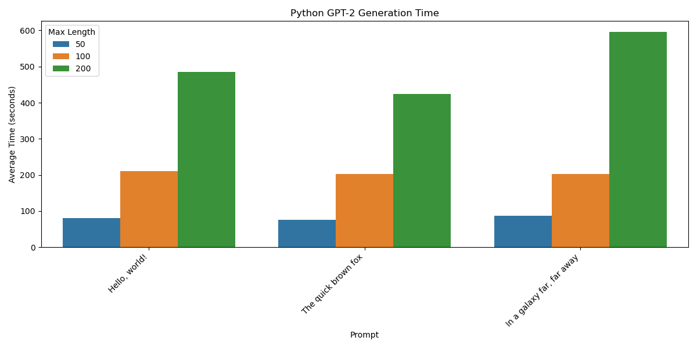
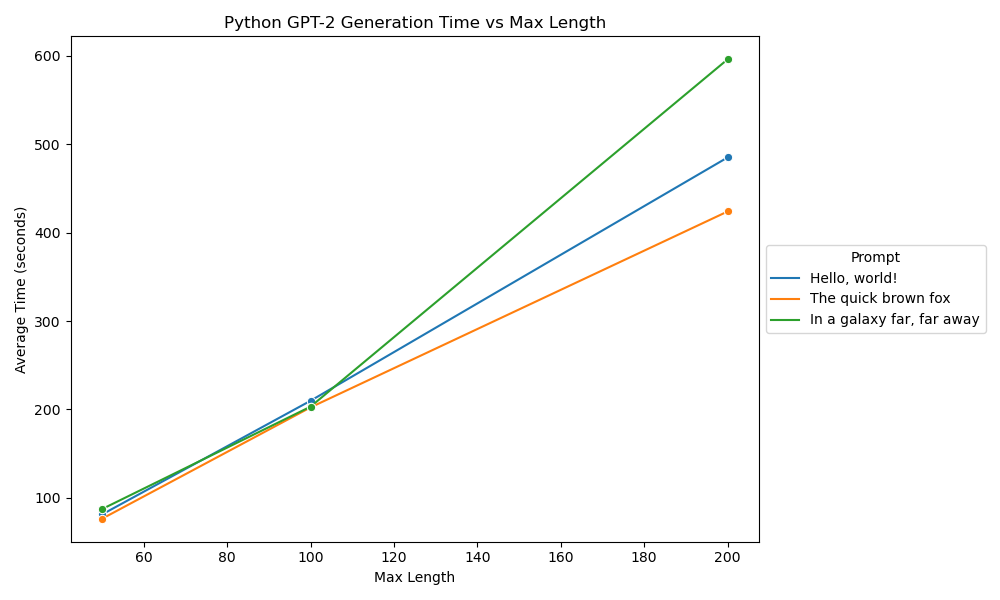

# Advanced GPT-2 Text Generation Benchmark

## Project Overview

This repository contains an implementation of an advanced GPT-2 text generation model, along with a benchmarking suite to evaluate its performance across various prompts and generation lengths. The project demonstrates cutting-edge natural language processing techniques, integrating PyTorch, JAX, ONNX, and FastAPI to create a versatile and efficient text generation pipeline.

## Key Components

1. `gpt2.py`: Core implementation of the GPT-2 model
2. `python_benchmark.py`: Benchmarking script to evaluate model performance

## Installation

1. Clone the repository:
```bash
git clone https://github.com/avijit-dhaliwal/gpt2-benchmark.git
cd gpt2-benchmark
```
2. Create a virtual environment (optional but recommended):
```bash
python -m venv venv
source venv/bin/activate  # On Windows, use venv\Scripts\activate
```
3. Install the required dependencies:
```bash
pip install -r requirements.txt
```

## Usage

### Running the GPT-2 Model

1. Start the FastAPI server:
```bash
python gpt2.py
```
2. The server will start running on `http://localhost:8000`

3. You can now make POST requests to `http://localhost:8000/generate` with a JSON payload:
```json
{
  "prompt": "Once upon a time",
  "max_length": 100
}
```
## Running the Benchmark

Ensure the FastAPI server is running (see above).
Run the benchmark script:
```bash
python python_benchmark.py
```
The script will generate two visualization files:

python_gpt2_benchmark.png: Bar plot of generation times
python_gpt2_benchmark_line.png: Line plot of generation times vs max length


Benchmark results will be saved in python_benchmark_results.npy

## Detailed Architecture

GPT-2 Model (gpt2.py)

The GPT2Advanced class in gpt2.py represents a sophisticated implementation of the GPT-2 architecture. Key features include:

Multi-framework Support: The model leverages PyTorch for primary computations, JAX for optimized CPU operations, and ONNX for cross-platform inference.

Transformer Architecture: Utilizes a stack of transformer blocks, each containing multi-head attention and feed-forward layers.

Tokenization: Integrates the Hugging Face GPT-2 tokenizer for consistent text processing.

Generation Capabilities: Implements both single-prompt and parallel multi-prompt text generation.

ONNX Integration: Supports ONNX inference for deployment flexibility.

Custom NumPy Operations: Includes a custom matrix multiplication function, demonstrating low-level optimization techniques.

FastAPI Integration: Exposes the model through a RESTful API for easy deployment and scaling.

## Benchmarking Suite (python_benchmark.py)

The benchmarking script provides a comprehensive evaluation of the GPT-2 model's performance:

Varied Prompts: Tests the model across diverse input prompts to assess generalization.

Multiple Generation Lengths: Evaluates performance for different output lengths (50, 100, 200 tokens).

Repeated Runs: Conducts multiple runs for statistical reliability.

Error Handling: Robust error management for network and API issues.

Data Visualization: Generates insightful plots using matplotlib and seaborn.

Results Persistence: Saves benchmark results for future analysis.

## Benchmark Results Analysis

The benchmark results, visualized in the provided images, offer valuable insights into the model's performance characteristics:

### Figure 1: Bar Plot Analysis




The bar plot illustrates the average generation time for different prompts and maximum lengths. Key observations:

Scaling with Length: Generation time consistently increases with the maximum token length across all prompts.
Prompt Sensitivity: The "In a galaxy far, far away" prompt shows slightly higher generation times, particularly for longer sequences, suggesting potential complexity in sci-fi context generation.
Non-linear Scaling: The increase in generation time from 100 to 200 tokens is more pronounced than from 50 to 100 tokens, indicating potential non-linear computational complexity.

### Figure 2: Line Plot Analysis



The line plot provides a clear visualization of how generation time scales with maximum length for each prompt:

Linear Trend: All prompts exhibit a roughly linear increase in generation time as the maximum length increases, suggesting good scalability of the model architecture.
Prompt Divergence: At higher token lengths, the generation times for different prompts begin to diverge more noticeably, with the sci-fi prompt ("In a galaxy far, far away") showing the steepest increase.
Efficiency at Lower Lengths: The minimal difference in generation times for shorter sequences (around 50 tokens) across prompts indicates efficient processing for brief outputs.
## Performance Implications

1. Scalability: The linear scaling of generation time with output length suggests good overall scalability of the model architecture.

2. Context Sensitivity: The variation in performance across prompts, particularly at higher token counts, indicates that the model's efficiency is somewhat context-dependent. This could be due to factors such as vocabulary distribution or the complexity of maintaining coherence in different narrative styles.

3. Optimization Opportunities: The steeper increase in generation time for longer sequences suggests potential for optimization, possibly through techniques like sparse attention or efficient caching mechanisms.

4. Deployment Considerations: For real-time applications, the results indicate that limiting output length to around 100 tokens could provide a good balance between generation quality and response time.

## Future Directions

1. Prompt Engineering: Further investigation into prompt design could help optimize performance for specific use cases or domains.

2. Architecture Refinement: Exploring variations in model architecture, such as different attention mechanisms or layer configurations, could potentially improve efficiency for longer sequences.

3. Hardware Acceleration: Benchmarking on different hardware (e.g., GPUs, TPUs) could provide insights into optimal deployment strategies.

4. Compression Techniques: Investigating model compression or distillation techniques could potentially reduce generation times while maintaining output quality.

5. Comparative Analysis: Benchmarking against other language models (e.g., GPT-3, BERT) could provide valuable context for the model's performance characteristics.
## Conclusion

This project demonstrates a sophisticated implementation of GPT-2, showcasing advanced techniques in model architecture, cross-framework integration, and performance analysis. The benchmarking results provide valuable insights into the model's behavior across different prompts and generation lengths, offering a solid foundation for further optimization and application-specific tuning. The observed linear scaling and context sensitivity highlight both the strengths of the current implementation and areas for potential future enhancements.

## Contributing

Contributions to this project are welcome. Please fork the repository and submit a pull request with your proposed changes.

## License

MIT License
## Contact

avijit.dhaliwal@gmail.com